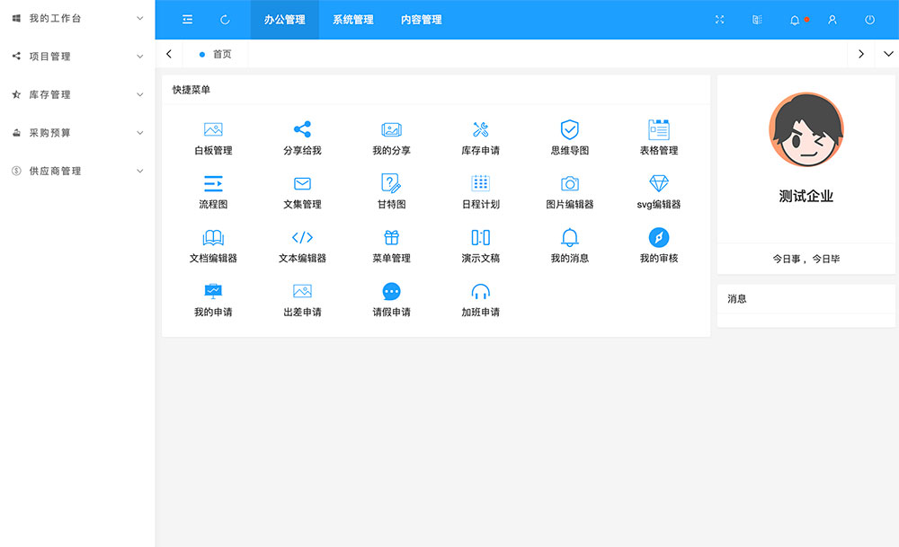
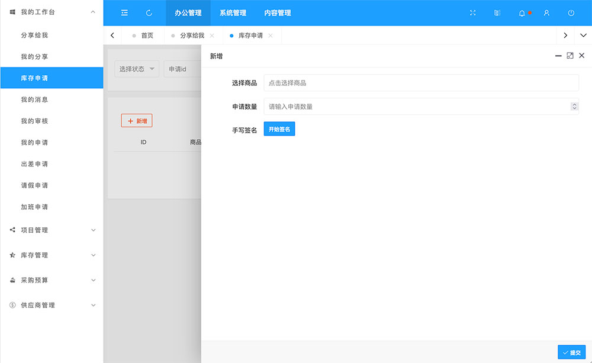
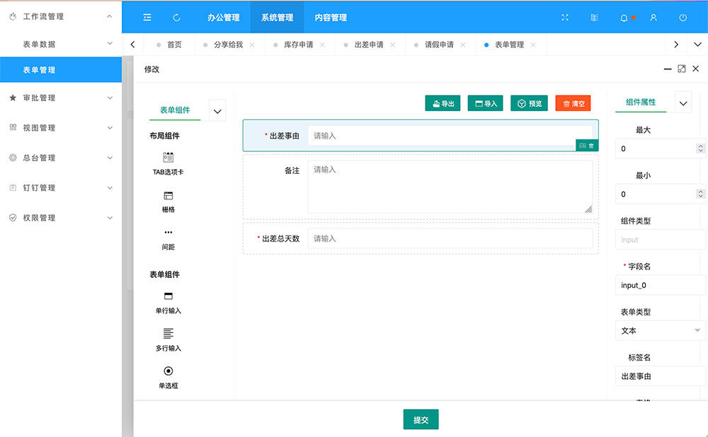
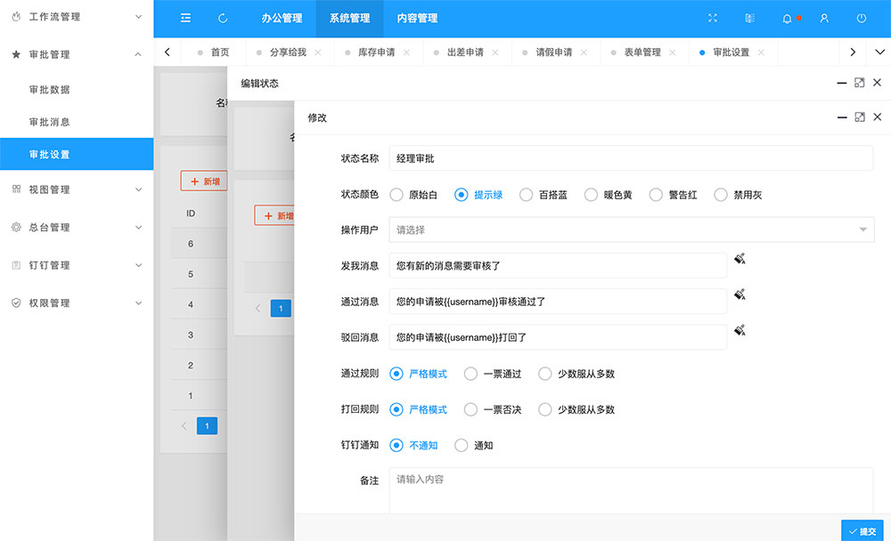
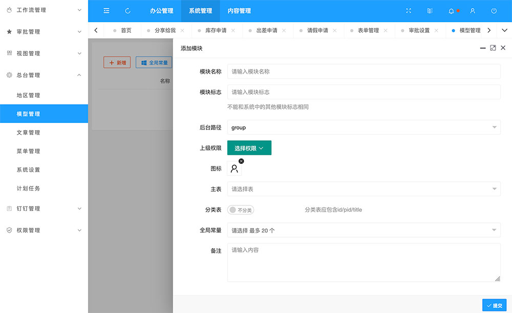
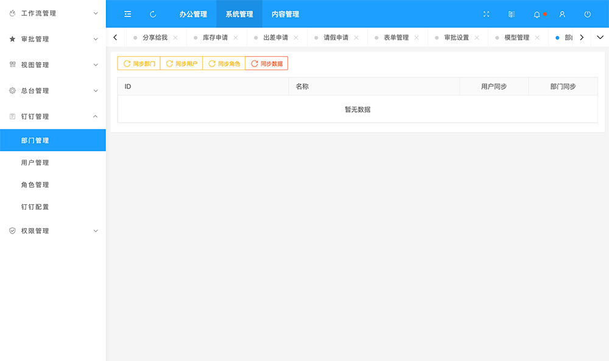
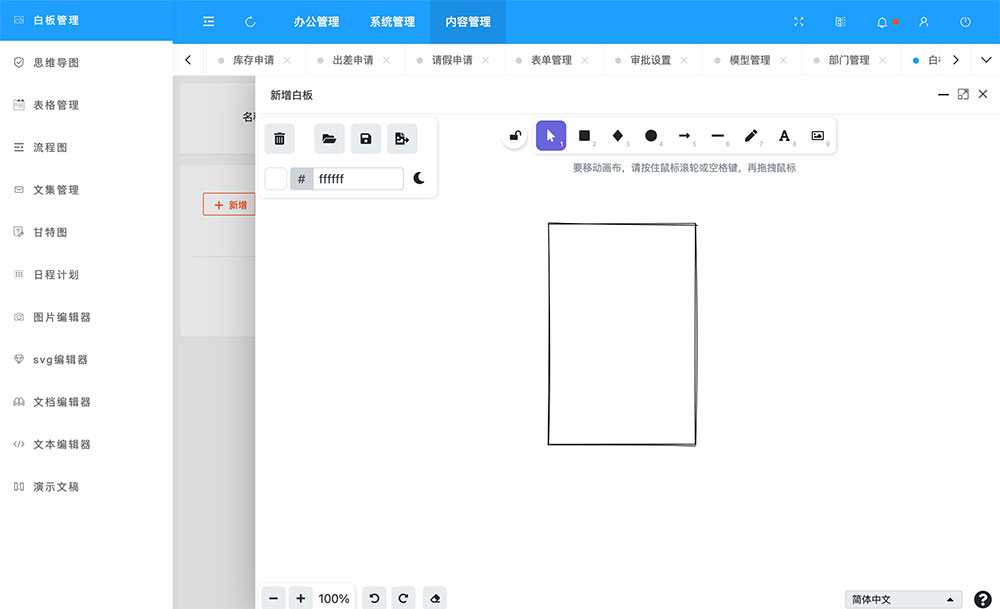
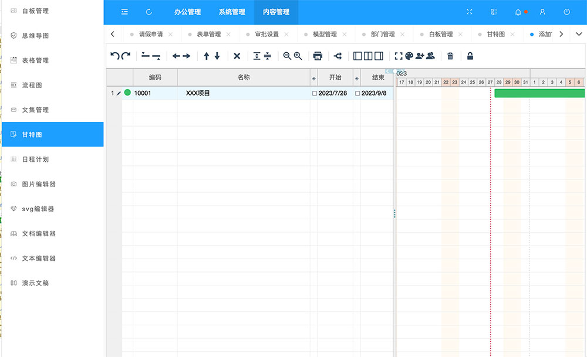
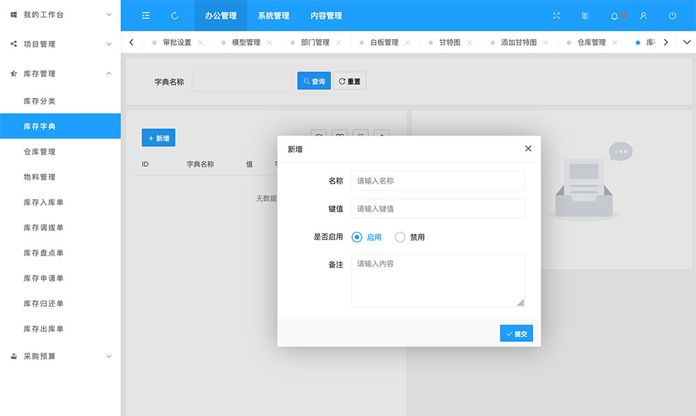
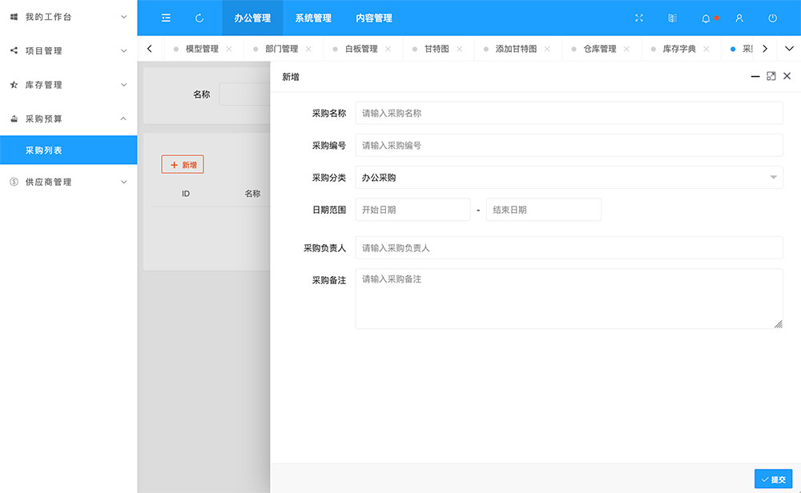

<p align="center">
    
</p>

<h1 align="center">GodoOA</h1>
<div align="center">

[![license][license-image]][license-url]

[FAQ](./Faq.md)

[license-image]: ./docs/license_%20MIT.svg
[license-url]: https://spdx.org/licenses/MIT.html
</div>

GodoOA是一套开源办公套件，遵从Apache License 2.0开源协议，非常适合二次开发，内含word/excel/ppt/pdf/svg/思维导图/流程图/日程管理等多个办公系统解决方案。godoOA对接了钉钉办公，数据互通，有效解决企业零碎化办公问题。

GodoOA开发原则是“**易上手，容易改**”。前端工程师和后端工程师都可以上手，没有复杂的包，学习成本低，简单的做一下二次开发，可以实现大型的复杂项目。

## 版本要求

```
node >=16
mysql >=5.7
```
## 安装


1. 下载后进程序根目录，运行

- 如未安装pnpm，需事先安装pnpm
```
npm i pnpm -g

```
- 安装依赖
```
pnpm i

```

2. 修改src/common/config.js数据库配置，并用数据库管理软件导入www/godocms.sql文件

- src/common/config.js第39行到42行
```
database: 'godocms',
port: '8889',
user: 'root',
password: 'root',
```

3. 测试环境运行
```
pnpm dev
```
然后访问
```
http://localhost:8200/res/group/login.html
```

4. 正式环境运行
- 参考根目录nginx.conf配置文件配置nginx
- 修改nginx.conf下的

```
# 你的域名
server_name www.gdoa.top;
#证书地址改下面两行 如不配置可删除
ssl_certificate /data/key/gdoa.top_chain.crt;
ssl_certificate_key /data/key/gdoa.top_key.key;
```
- 以及

```
 #当前程序的绝对路径
root /data/www;
```

- 修改pm2.json下第5 行
```
 "cwd": "/data/godo", //当前程序的绝对路径
```
- 然后运行
```
pm2 start pm2.json
```

5. 后台登录
```
账户：admin

密码：111111
```

## 演示地址

[http://gdoa.top](http://gdoa.top/res/group/login.html)
```
账户：admin

密码：111111
```

## 项目地址


[gitee](https://gitee.com/ruitao_admin/gdoa)

[github](https://github.com/phpk/gdoa)

## 功能说明


1. 库存管理

- 可适配生产/维修/零售等企业库存管理，内含入库/盘点/调拨等功能，可自定义字段。
- 包含库存分类/库存字典/仓库管理/物料管理/库存入库单/库存调拨单/库存盘点单/库存申请单/库存归还单/库存出库单等模块。


2. 采购预算

- 分大/小类的采购预算，excel表导入，数据自动归算，和权限流引擎完美结合。
- 小类可无限分级，支持单项申报。


3. 自定义表单

- 极易入手的自定义表单，一次配置，表单/表格/搜索一步生成，简洁高效。


4. 审计流引擎

- 结合自定义表单可完成大部分工作流。可回退，支持钉钉通知，支持规则配置。


5. 办公白板

- 集自由布局、画笔、便签多种创意表达能力于一体，激发团队创造力，随时随地，围绕一块白板沟通。


6. 思维导图

- 支持四种结构；内置多种主题；支持快捷键；节点内容支持图片、图标、超链接、备注、标签。


7. excel表格

- 支持公式和函数：内置公式，远程公式，自定义公式；表格操作：筛选，排序，数据验证。


8. 流程图

- 项目经理的硬核工具，包含图形/拓扑图/图表/权限流/工作流五个流程图编辑工具。


9. 文集管理

- 使用说明书/开发文档的生成工具。可以自动生成，可以回写，可以书写多个说明文档。


10. 甘特图

- 项目管理必备工具，支持自定义项目人员和角色，支持拖拽/管理分配（资源、角色、工作）等。


11. 日程计划

- 支持各种视图类型：每日、每周、每月；支持里程碑和任务计划的高效管理，周末宽度。


12. 图片编辑器

- 支持裁剪、翻转、旋转、绘图、形状、图标、文本、遮罩过滤器、图像过滤器。


13. svg编辑器

- svg在线编辑器，基于svgedit。支持增/删/改/查，支持导入/导出svg。


14. 文档编辑器

- 支持底层识别图片/ppt/word/pdf等几乎所有办公文件，无需使用外部接口。


15. 文本编辑器

- 支持打开text/html/css/js/svg/xml/md等，可以当作一个简单的在线editplus。


16. ppt演示文稿

- 在线PowerPoint幻灯片，支持文字、图片、形状、线条、图表、表格、视频、公式等。

17. 分享管理

- 办公白板/思维导图/excel表格/流程图/文集管理/甘特图/文档/文本可分享给组织内部其他人编辑，每次编辑都可查看历史可回档。

18. 钉钉同步

- 使用钉钉企业内部应用，支持钉钉配置登录，同步钉钉部门/用户/角色。

19. 供应商管理

- 和采购/库存结合，支持供应商商品管理。

20. 项目管理

- 简洁的项目管理体系，包含项目管理/项目文件/项目分类。

21. 权限管理

- 完备的权限管理机制，支持部门/用户/角色/公司/岗位/门店/项目多维度管理。


## 演示图片













## 关联项目
- [godoos](https://gitee.com/ruitao_admin/godoos)
- [gododb](https://gitee.com/ruitao_admin/gododb)

## 微信群


## 开源

- 承诺永久免费开源
- 允许企业/个人单独使用
- 如用于商业活动或二次开发，请购买相关版权
- 不提供私下维护工作，如有bug请 [issures](https://gitee.com/ruitao_admin/godooa/issues) 提交
- 请尊重作者的劳动成果
